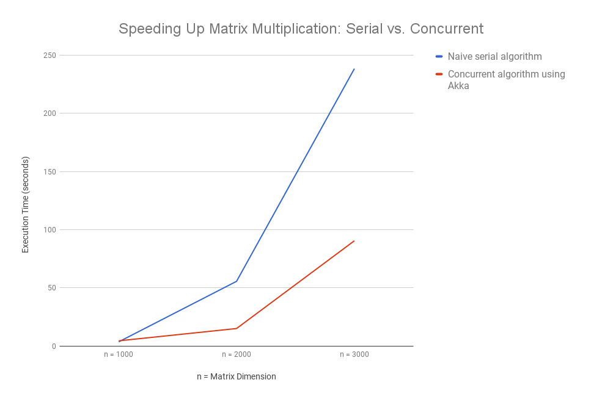

# project-strassen

## Purpose
Matrix multiplication is widely used in many facets of the software industry (e.g. to carry out numerical analysis, graphic transformations, scientific computing, pattern recognition, etc.) and unfortunately it is very computationally heavy. A straightforward iterative approach is on the order of O(n3).

#### MultiplySerial.scala
* Serial iterative approach to matrix multiplication on the order of O(n3)

#### MultiplyAkka.scala
* Concurrent actor model approach to matrix multiplication.
* For every dimension of an N by N matrix, create an actor to compute the workload of that particular dimension.
* Choosing the number of actors is very important to provide the right balance of parallelism while avoiding the downfalls (e.g. overhead in context-switching, network I/O). In this particular case, a maximum of N number of actors avoids introducing the possibility of any race conditions.

## Initial Results:
Here is some initial runtime analysis between the serial vs. concurrent algorithm. Please keep in mind that these tests were done on an Intel Core i5 @ 2.60 GHz (2 cores, 4 threads) with 8GB ram so the concurrent algorithm was severely bottlenecked and spent a lot of time context switching. If this were run on an actual Akka cluster the results would have likely been even more advantageous to the concurrent algorithm.

## Computational Workload:
* n = 1000 for a total of 1,000,000 elements to be computed
* n = 2000 for a total of 4,000,000 elements to be computed
* n = 3000 for a total of 9,000,000 elements to be computed

### 

## For more information:
1. https://en.wikipedia.org/wiki/Actor_model
1. https://doc.akka.io/docs/akka/snapshot/scala/guide/actors-motivation.html
1. https://doc.akka.io/docs/akka/snapshot/scala/guide/actors-intro.html
1. https://doc.akka.io/docs/akka/snapshot/scala/general/terminology.html

## Work in progress:
* Further speeding up the computation by applying [Strassen's algorithm](https://en.wikipedia.org/wiki/Strassen_algorithm)
